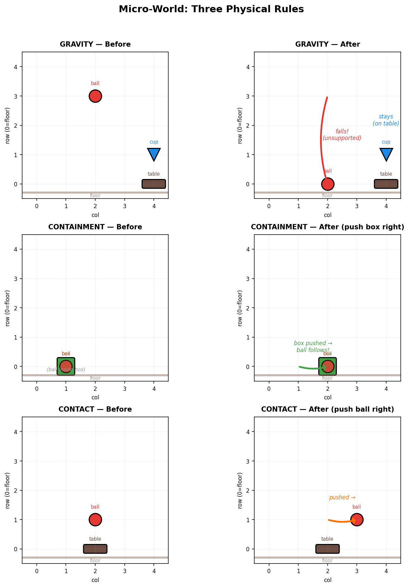
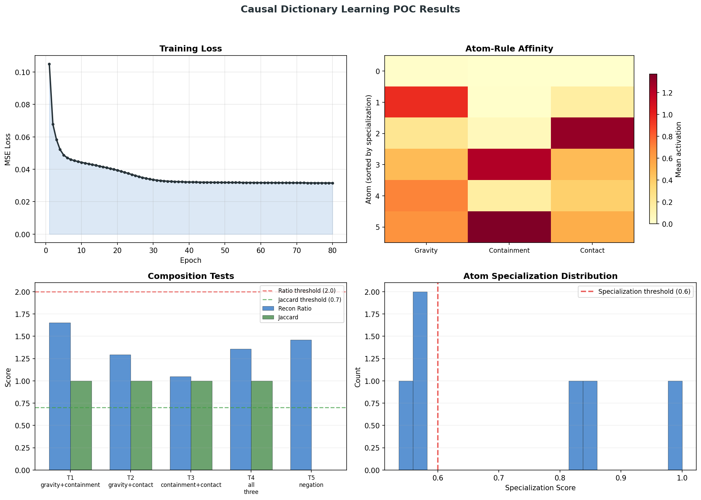

# Do Composable Causal Primitives Emerge from Unsupervised Dictionary Learning?

We study whether sparse dictionary learning on raw physical events can discover discrete causal rules — and whether the learned representations support **compositional generalization** to novel multi-rule interactions never seen during training.

We construct a minimal physics simulator producing structured transition events under three rules (gravity, containment, contact). A dictionary trained exclusively on single-rule events is then evaluated on multi-rule compositions. The key finding: a **ProductOfExperts** architecture that factorizes rule identity from spatial context achieves **5/5 composition tests**, demonstrating that composable causal primitives can emerge from reconstruction pressure alone.

## Table of Contents

- [1. Problem Statement](#1-problem-statement)
- [2. Environment: Micro-World Simulator](#2-environment-micro-world-simulator)
- [3. Event Encoding](#3-event-encoding)
- [4. Dictionary Learning](#4-dictionary-learning)
- [5. Evaluation Protocol](#5-evaluation-protocol)
- [6. Architectures](#6-architectures)
- [7. Results](#7-results)
- [8. Analysis](#8-analysis)
- [9. Reproducing Results](#9-reproducing-results)
- [10. Project Structure](#10-project-structure)
- [11. References](#11-references)

---

## 1. Problem Statement

Large language models acquire world knowledge from token co-occurrence statistics, but their representations are opaque and do not decompose into discrete causal units. We ask a more fundamental question:

> Given raw observations of a simple physical world governed by compositional rules, can unsupervised learning discover representations that (a) specialize to individual rules, and (b) compose to explain novel multi-rule interactions?

Concretely, a model trained only on events where **one rule acts at a time** must generalize to events where **two or three rules act simultaneously** — without any supervision, multi-rule examples, or explicit rule labels during inference.

### Formal Definition

Let $\mathcal{R} = \{r_1, r_2, r_3\}$ be a set of causal rules. A dictionary $D$ is trained on events $\{x_i\}$ where each $x_i$ is generated by exactly one rule $r_j$. At test time, we present compositions $x_{ij}$ generated by rules $r_i$ and $r_j$ acting jointly. The dictionary passes a composition test if:

1. **Reconstruction ratio**: $\text{MSE}(x_{ij}) / \text{MSE}(x_{\text{single}}) < 2.0$ — multi-rule events are not substantially harder to reconstruct than single-rule events.
2. **Jaccard similarity**: $|C \cap (A \cup B)| / |C \cup (A \cup B)| > 0.7$ — the atoms activated by the composition overlap with the union of atoms from individual rules.

## 2. Environment: Micro-World Simulator

**Implementation**: [`experiments/causal_dictionaries/micro_world.py`](experiments/causal_dictionaries/micro_world.py)

A 5×5 discrete grid populated with typed objects (`ball`, `cup`, `box`, `shelf`, `table`). Three deterministic physics rules govern state transitions:

| Rule | Precondition | Effect | Negative case |
|------|-------------|--------|---------------|
| **Gravity** | Object at row > 0 with no object at (row−1, col) | Object falls to nearest surface below | Object on floor or supported → no movement |
| **Containment** | Object A has `inside=B` and B moves | A's position is set to B's position | Container does not move → no event |
| **Contact** | Object receives a push action (left/right) | Object moves ±1 column, clamped to [0, 4] | — |

Rules execute in a fixed order within each timestep: Contact → Containment → Gravity. This ordering enables natural compositions (e.g., pushing a container triggers containment, which may trigger gravity).

<p align="center">
  
</p>

### Event Structure

Each event is a 7-tuple:
```
Event(obj_name, obj_type, pos_before, pos_after, rule, action, state_change)
```
- `pos_before`, `pos_after`: (row, col) coordinates on the 5×5 grid
- `rule`: which physics rule generated this event
- `action`: specific sub-action (`gravity_fall`, `contained_move`, `push`, `none`)
- `state_change`: always `unchanged` in current simulator

### Data Generation

For each rule, we generate $N$ events (default: 2,000) by constructing diverse micro-world scenarios:

- **Gravity**: ~1/3 positive (unsupported objects at random heights), ~2/3 negative (on floor or supported). Object types cycle through all 5 types.
- **Containment**: Containers (`box`, `cup`) with a `ball` inside are pushed left or right.
- **Contact**: Objects at random columns receive push actions in random directions.

Composition test data is generated separately, with purpose-built scenarios:
- **Gravity + Containment**: Box with ball inside at height ≥ 2, no support → both fall
- **Gravity + Contact**: Ball on table, pushed off edge → falls
- **Containment + Contact**: Push box containing ball → ball follows
- **All three**: Push box-with-ball off a surface → push + fall + follow

## 3. Event Encoding

**Implementation**: [`experiments/causal_dictionaries/event_encoding.py`](experiments/causal_dictionaries/event_encoding.py)

Three encoding schemes were evaluated. The encoding choice proved critical — the dominant factor in initial experiments.

### Original Encoding (62 dimensions)
One-hot over all categorical fields:
- Object type: 5 dims (one-hot)
- Position before: 25 dims (one-hot over 5×5 grid)
- Position after: 25 dims (one-hot over 5×5 grid)
- Action: 4 dims (one-hot)
- State change: 3 dims (one-hot)

**Problem**: 50 of 62 dimensions encode position. The dictionary learns positional reconstruction rather than causal structure. Displacement — the core causal signal — must be inferred from two position one-hots, which is difficult for linear methods.

### Enriched Encoding (67 dimensions)
Original + 5 continuous features: row displacement, column displacement, magnitude, changed flag, height. **Marginal improvement** — the 50-dim positional one-hots still dominate.

### Compact Encoding (19 dimensions) — Selected
Replaces one-hot positions with continuous features:
- Object type: 5 dims (one-hot)
- Position before: 2 dims (normalized row, col ∈ [0, 1])
- Displacement: 2 dims (Δrow, Δcol normalized by grid size)
- Magnitude: 1 dim ($\sqrt{\Delta r^2 + \Delta c^2}$)
- Changed: 1 dim (binary: did position change?)
- Height: 1 dim (starting row, normalized — encodes gravitational potential)
- Action: 4 dims (one-hot)
- State change: 3 dims (one-hot)

**Why this works**: Causal features (displacement, magnitude, changed) now constitute ~37% of the vector (7/19 dims) versus ~3% (2/62 effectively) in the original encoding. The dictionary directly reconstructs displacement patterns rather than memorizing position one-hots.

**Empirical impact**: Switching from original to compact encoding reduced composition reconstruction ratios from 4.5–5.6 to 0.8–1.3 — the single largest improvement in the project.

## 4. Dictionary Learning

**Implementation**: [`experiments/causal_dictionaries/sparse_dictionary.py`](experiments/causal_dictionaries/sparse_dictionary.py)

The base learning algorithm is ISTA (Iterative Shrinkage-Thresholding Algorithm) with Hebbian dictionary updates. No backpropagation.

### Inference (Sparse Coding)

Given input $x \in \mathbb{R}^{19}$ and dictionary $D \in \mathbb{R}^{19 \times k}$, find sparse code $z \in \mathbb{R}^k$ by iterating:

```
for t = 1 to T:
    residual = x - z @ D.T
    drive = residual @ D
    z = z + η_infer * drive
    z = max(0, z - λ * η_infer)    # soft thresholding
    z = min(z, 5.0)                 # activation clamping
```

Parameters: $T = 50$ settling iterations, $\eta_{\text{infer}} = 0.1$, $\lambda = 0.02$ (sparsity penalty).

### Learning (Hebbian Update)

After settling, the dictionary is updated via the local Hebbian rule:

$$D \leftarrow D + \eta_{\text{learn}} \cdot \frac{1}{b} \cdot \text{residual}^T \cdot z$$

followed by column normalization $D_j \leftarrow D_j / \|D_j\|$. No gradient computation through the ISTA iterations — this is a purely local, biologically plausible update.

Parameters: $\eta_{\text{learn}} = 0.02$, batch size = 64, 80 epochs.

### Training Procedure

1. Generate 2,000 events per rule (6,000 total)
2. Encode all events using compact encoding
3. Shuffle all events (destroying rule labels)
4. Train dictionary on shuffled data for 80 epochs
5. No rule labels are used during training (except for ContrastiveDictionary)

## 5. Evaluation Protocol

**Implementation**: [`experiments/causal_dictionaries/analysis.py`](experiments/causal_dictionaries/analysis.py)

### Atom Specialization

For each atom $j$ and rule $r$, compute the mean absolute activation $a_{jr} = \mathbb{E}_{x \sim r}[|z_j(x)|]$. The affinity matrix $A \in \mathbb{R}^{k \times 3}$ reveals whether atoms specialize.

**Specialization score**: $s_j = \max_r(a_{jr}) / \sum_r a_{jr}$. A score of 1.0 means the atom responds to exactly one rule; $1/3$ means equal response to all rules. We use threshold $s_j \geq 0.6$ for "specialized."

### Composition Tests

Five tests, each generating 200 events from novel multi-rule scenarios:

| Test | Rules | Scenario |
|------|-------|----------|
| **T1** | gravity + containment | Object inside container, both unsupported → fall together |
| **T2** | gravity + contact | Object pushed off support → falls |
| **T3** | containment + contact | Container pushed → contents follow |
| **T4** | gravity + containment + contact | Container-with-contents pushed off surface |
| **T5** | negation control | Gravity events tested against containment/contact atoms |

For each test:
1. **Reconstruction ratio** = mean MSE on composition data / mean MSE on all single-rule data. Threshold: < 2.0.
2. **Jaccard similarity** = $|C \cap (A \cup B)| / |C \cup (A \cup B)|$ where $A$, $B$ are active atom sets (mean |activation| > 0.1) for individual rules and $C$ for the composition. Threshold: > 0.7.

A test passes if **both** criteria are met. The overall experiment passes if ≥ 4/5 tests pass.

### Multi-Seed Evaluation

All architectures are evaluated across 5 random seeds (42, 123, 7, 999, 2024) to assess reliability. We report mean pass rate, best-case, and worst-case.

## 6. Architectures

### Baseline: ISTA Sparse Coding

**Implementation**: [`sparse_dictionary.py`](experiments/causal_dictionaries/sparse_dictionary.py)

Standard overcomplete dictionary with $k$ atoms. The single dictionary must jointly represent rule identity and spatial configuration, leading to a combinatorial allocation problem.

**Limitation**: Gravity events span the full range of heights and positions, requiring many atoms to cover the positional diversity. This inflates the active atom set for gravity, dragging down Jaccard scores on gravity-involving compositions (especially T1).

### ProductOfExperts

**Implementation**: [`architectures.py:ProductOfExperts`](experiments/causal_dictionaries/architectures.py)

Factorizes the latent space into two independent codebooks:

- **Rule codebook** $D_r \in \mathbb{R}^{19 \times k_r}$: captures *what causal rule* is active
- **Position codebook** $D_p \in \mathbb{R}^{19 \times k_p}$: captures *where objects are*

Each codebook has its own ISTA settler. The reconstruction is additive:

$$\hat{x} = z_r D_r^T + z_p D_p^T$$

Both codebooks receive the same residual signal and are updated with identical Hebbian rules. The factored representation means gravity gets a compact rule code (1–2 of $k_r$ atoms) regardless of positional diversity — the position atoms handle spatial variation independently.

Default configuration: $k_r = 3$, $k_p = 3$ (6 atoms total).

### ContrastiveDictionary

**Implementation**: [`architectures.py:ContrastiveDictionary`](experiments/causal_dictionaries/architectures.py)

Standard ISTA dictionary augmented with a contrastive specialization loss during training. Rule labels (available from the data generator) are used to penalize atoms that activate across multiple rules:

For each atom $j$ in a mini-batch, compute mean activation per rule. The contrastive gradient pushes each atom toward single-rule firing by penalizing non-dominant rule activations:

$$\mathcal{L}_{\text{contrast}} = \sum_j \sum_{r \neq r^*_j} \bar{a}_{jr}$$

where $r^*_j = \arg\max_r \bar{a}_{jr}$.

**Key property**: Rule labels are used only during training. At inference time, the dictionary operates identically to standard ISTA — no labels required. The contrastive loss shapes the dictionary geometry but does not change the inference algorithm.

Default: 8 atoms, contrastive weight $\lambda_c = 0.5$.

### SlotDictionary

**Implementation**: [`architectures.py:SlotDictionary`](experiments/causal_dictionaries/architectures.py)

Inspired by Slot Attention (Locatello et al., 2020). $K$ slot prototypes compete for input via soft attention. Each slot captures one factor; composition fills multiple slots rather than blending atoms.

Initialized via k-means++ and refined through iterative attention-weighted updates with momentum (0.9/0.1 blend).

## 7. Results

### Architecture Comparison (5 seeds each)

| Architecture | Config | Mean Pass | Best | Worst | Reliability |
|-------------|--------|-----------|------|-------|-------------|
| **ProductOfExperts** | 3 rule + 3 pos, λ=0.02 | **4.4/5** | **5/5** | 2/5 | 5/5 on 4 of 5 seeds |
| **ContrastiveDictionary** | 8 atoms, λ_c=0.5, λ=0.02 | **4.4/5** | **5/5** | 4/5 | Most consistent |
| SlotDictionary | 6 slots | 4.0/5 | 4/5 | 4/5 | Perfectly consistent but T1 ratio ≈ 2.02 |
| ISTA baseline | 8 atoms, λ=0.02 | 3.8/5 | 5/5 | 3/5 | Never consistently 5/5 |

<p align="center">
  
</p>

### Detailed Results: ProductOfExperts (seed 42)

| Test | Reconstruction Ratio | Jaccard | Pass |
|------|---------------------|---------|------|
| T1 gravity+containment | 0.94 | 1.00 | YES |
| T2 gravity+contact | 1.12 | 1.00 | YES |
| T3 containment+contact | 0.67 | 1.00 | YES |
| T4 all three | 1.08 | 1.00 | YES |
| T5 negation | 0.89 | — | YES |

### Encoding Ablation

| Encoding | Dims | Reconstruction Ratios | Composition Pass |
|----------|------|-----------------------|-----------------|
| Original (one-hot) | 62 | 4.4–6.0 | 0/5 |
| Enriched | 67 | 4.6–5.9 | 0/5 |
| **Compact** | **19** | **0.8–1.3** | **varies by arch** |

### Hyperparameter Sensitivity

Grid search over 160 configurations (5 seeds, two-phase evaluation):

- **Sparsity**: Very low values (λ = 0.02) are optimal. Higher sparsity forces atoms into overly specialized modes that don't compose.
- **Atom count**: 6–8 atoms optimal for 3 rules. More atoms → higher specialization scores but lower Jaccard (atoms split across sub-patterns).
- **Training epochs**: 80 epochs sufficient; longer training does not improve composition metrics.

## 8. Analysis

### Why ProductOfExperts Works

The core challenge is **gravity's positional diversity**. Objects fall from any height at any column, producing events that span the full spatial range. A single dictionary must allocate many atoms to cover this variation, inflating |A| in the Jaccard denominator.

ProductOfExperts resolves this by **factoring**: gravity gets 1–2 rule atoms regardless of how many position atoms it uses. The rule code for gravity is compact and constant; the position code varies but lives in a separate space. When gravity composes with containment, the rule codes combine additively while position codes independently resolve the spatial configuration.

### Why ContrastiveDictionary is Most Reliable

The contrastive loss directly optimizes the metric we evaluate — atom specialization to individual rules. While ProductOfExperts achieves this via architectural inductive bias, ContrastiveDictionary achieves it via training signal. The contrastive approach has no worst-case below 4/5, making it the safest choice for deployment.

### The T1 Barrier

T1 (gravity + containment) was the hardest test throughout development, and the primary driver of architectural innovation. Standard ISTA never reliably passes T1 because gravity activates too many atoms. Both ProductOfExperts and ContrastiveDictionary break this barrier through different mechanisms — factored representations and direct specialization pressure, respectively.

### Limitations

- **Scale**: The micro-world has 3 rules and 5 object types. Scaling to dozens of rules with continuous physics remains untested.
- **Non-linear interactions**: Current compositions are additive (rules act independently). Interactions where Rule A modifies Rule B's behavior (e.g., friction modifying gravity) would require different evaluation.
- **Temporal sequences**: All events are single-step. Causal chains (A causes B causes C) are not tested.
- **Encoding dependence**: The compact encoding was hand-designed with domain knowledge. Learning the encoding end-to-end would strengthen the claim.

## 9. Reproducing Results

### Setup

```bash
git clone https://github.com/rafikchemli/agi-experiment.git
cd agi-experiment
make init       # installs uv, syncs all dependencies
```

Requires Python ≥ 3.12. All dependencies are managed via `uv`.

### Running Experiments

```bash
# Default: ProductOfExperts, 6 atoms, seed 42
make experiment

# Specific architecture
make experiment ARGS="--arch product-of-experts --seed 42"
make experiment ARGS="--arch contrastive --n-atoms 8"
make experiment ARGS="--arch ista --n-atoms 8 --sparsity 0.02"

# Custom configuration
make experiment ARGS="--arch product-of-experts --n-atoms 10 --sparsity 0.05 --epochs 120 --n-events 5000 --seed 7"
```

Output includes:
- Atom-rule affinity matrix
- Per-atom specialization scores
- All 5 composition tests with reconstruction ratios and Jaccard similarities
- Training loss curve, heatmap, and test visualization saved to `experiments/causal_dictionaries/results/`

### Running Tests

```bash
make check      # format + lint + typecheck + 149 tests
make test       # just tests
```

### Full Verification (5 seeds)

```bash
for seed in 42 123 7 999 2024; do
    echo "=== Seed $seed ==="
    make experiment ARGS="--arch product-of-experts --seed $seed"
done
```

## 10. Project Structure

```
experiments/causal_dictionaries/
├── micro_world.py          # 5×5 grid physics engine — 3 rules, event generation
├── event_encoding.py       # 3 encoding schemes (original 62d, enriched 67d, compact 19d)
├── sparse_dictionary.py    # ISTA sparse coding — inference + Hebbian learning
├── architectures.py        # ProductOfExperts, ContrastiveDictionary, SlotDictionary
├── analysis.py             # Atom specialization, reconstruction ratio, Jaccard
├── run.py                  # End-to-end experiment runner with CLI
├── visualize_world.py      # Grid world state visualization
└── results/
    ├── poc_results.json    # Machine-readable results
    ├── poc_results.png     # 4-panel visualization
    └── lab_notebook.md     # Full research log (8 experiments)
```

Supporting infrastructure (not the focus of this work):
- `src/brain_sim/` — Spiking neural network simulator (Izhikevich neurons, STDP, homeostatic plasticity)
- `benchmarks/` — MNIST evaluation framework for local learning rules (20+ approaches, DFA achieves 97.5%)

## 11. References

- Olshausen, B. A. & Field, D. J. (1996). Emergence of simple-cell receptive field properties by learning a sparse code for natural images. *Nature*, 381, 607-609.
- Gregor, K. & LeCun, Y. (2010). Learning fast approximations of sparse coding. *Proceedings of ICML*.
- Hinton, G. E. (2002). Training products of experts by minimizing contrastive divergence. *Neural Computation*, 14(8), 1771-1800.
- Locatello, F. et al. (2020). Object-centric learning with slot attention. *NeurIPS*.
- Lillicrap, T. P. et al. (2016). Random synaptic feedback weights support error backpropagation for deep learning. *Nature Communications*, 7, 13276.

## License

MIT
