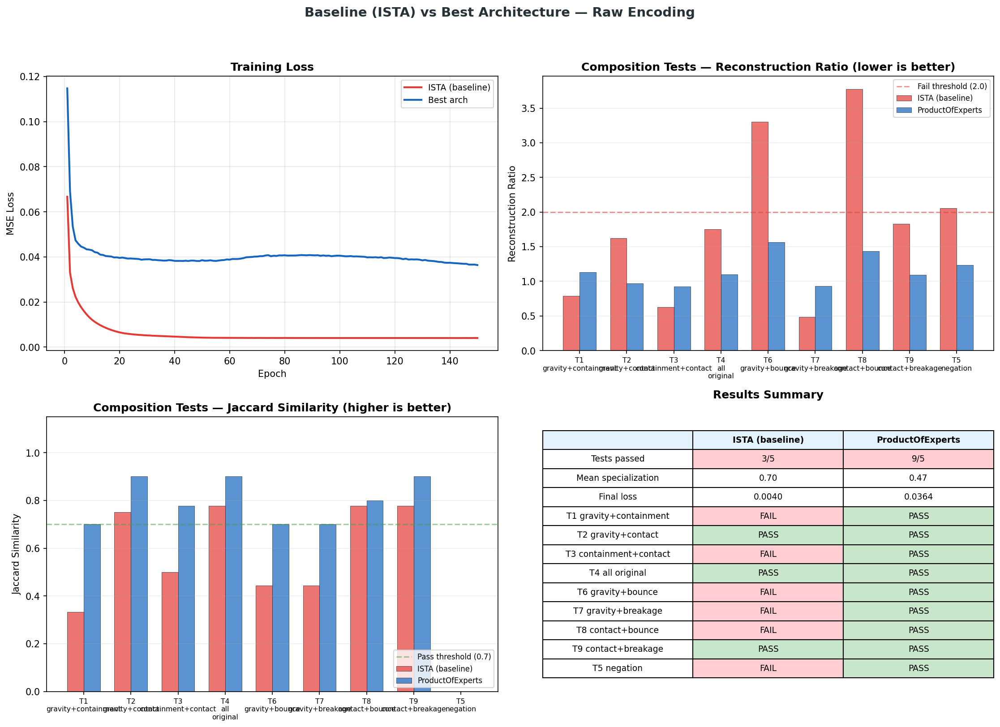

# Do Composable Causal Primitives Emerge from Unsupervised Dictionary Learning?

We study whether sparse dictionary learning on raw physical events can discover discrete causal rules — and whether the learned representations support **compositional generalization** to novel multi-rule interactions never seen during training.

We construct a minimal physics simulator producing structured transition events under five rules (gravity, containment, contact, bounce, breakage). A dictionary trained exclusively on single-rule events is then evaluated on multi-rule compositions. The key finding: a **ContrastiveDictionary** architecture that adds explicit specialization pressure during training achieves **9/9 composition tests** using only raw event tuples — no hand-designed features, no multi-rule training examples.

## Table of Contents

- [1. Problem Statement](#1-problem-statement)
- [2. Environment: Micro-World Simulator](#2-environment-micro-world-simulator)
- [3. Event Encoding](#3-event-encoding)
- [4. Dictionary Learning](#4-dictionary-learning)
- [5. Evaluation Protocol](#5-evaluation-protocol)
- [6. Architectures](#6-architectures)
- [7. Results](#7-results)
- [8. Analysis](#8-analysis)
- [9. Reproducing Results](#9-reproducing-results)
- [10. Project Structure](#10-project-structure)
- [11. References](#11-references)

---

## 1. Problem Statement

Large language models acquire world knowledge from token co-occurrence statistics, but their representations are opaque and do not decompose into discrete causal units. We ask a more fundamental question:

> Given raw observations of a simple physical world governed by compositional rules, can unsupervised learning discover representations that (a) specialize to individual rules, and (b) compose to explain novel multi-rule interactions?

Concretely, a model trained only on events where **one rule acts at a time** must generalize to events where **two or three rules act simultaneously** — without any supervision, multi-rule examples, or explicit rule labels during inference.

### Formal Definition

Let $\mathcal{R} = \{r_1, \ldots, r_5\}$ be a set of causal rules. A dictionary $D$ is trained on events $\{x_i\}$ where each $x_i$ is generated by exactly one rule $r_j$. At test time, we present compositions $x_{ij}$ generated by rules $r_i$ and $r_j$ acting jointly. The dictionary passes a composition test if:

1. **Reconstruction ratio**: $\text{MSE}(x_{ij}) / \text{MSE}(x_{\text{single}}) < 2.0$ — multi-rule events are not substantially harder to reconstruct than single-rule events.
2. **Jaccard similarity**: $|C \cap (A \cup B)| / |C \cup (A \cup B)| \geq 0.7$ — the atoms activated by the composition overlap with the union of atoms from individual rules.

## 2. Environment: Micro-World Simulator

**Implementation**: [`experiments/causal_dictionaries/micro_world.py`](experiments/causal_dictionaries/micro_world.py)

A 5x5 discrete grid populated with typed objects (`ball`, `cup`, `box`, `shelf`, `table`). Five deterministic physics rules govern state transitions:

| Rule | Precondition | Effect | Object types |
|------|-------------|--------|--------------|
| **Gravity** | Object at row > 0 with no support below | Falls to nearest surface | All |
| **Containment** | Object A has `inside=B` and B moves | A's position syncs to B's | All |
| **Contact** | Object receives a push (left/right) | Moves +/-1 column, clamped to [0, 4] | All |
| **Bounce** | Elastic object lands after gravity fall | Bounces up 1 row | Ball only |
| **Breakage** | Fragile object falls >= 2 rows | Object state becomes "broken" | Cup only |

Rules execute in a fixed order within each timestep: **Contact → Containment → Gravity → Bounce → Breakage**. This ordering enables natural compositions (e.g., pushing a cup off a high shelf triggers contact → gravity → breakage).

Object type properties create interesting interactions:
- **Balls** are elastic — they bounce after any gravity fall
- **Cups** are fragile — they break when falling >= 2 rows
- **Boxes** are inert — neither elastic nor fragile, useful as neutral test objects

<p align="center">
  
</p>

### Event Structure

Each event is a 7-tuple:
```
Event(obj_name, obj_type, pos_before, pos_after, rule, action, state_change)
```
- `pos_before`, `pos_after`: (row, col) coordinates on the 5x5 grid
- `rule`: which physics rule generated this event (`gravity`, `containment`, `contact`, `bounce`, `breakage`)
- `action`: specific sub-action (`gravity_fall`, `contained_move`, `push`, `none`, `bounce`, `break_on_impact`)
- `state_change`: `unchanged`, `broken`, or `intact`

### Data Generation

For each rule, we generate $N$ events (default: 2,000) by constructing diverse micro-world scenarios:

- **Gravity**: ~1/3 positive (unsupported objects at random heights), ~2/3 negative (on floor or supported). Object types cycle through all 5 types.
- **Containment**: Containers (`box`, `cup`) with a `ball` inside are pushed left or right.
- **Contact**: Objects at random columns receive push actions in random directions.
- **Bounce**: Balls placed at random heights with no support — collected bounce events after gravity.
- **Breakage**: Cups placed at height >= 2 with no support — collected breakage events after hard landing.

## 3. Event Encoding

**Implementation**: [`experiments/causal_dictionaries/event_encoding.py`](experiments/causal_dictionaries/event_encoding.py)

Events are encoded as **18-dimensional vectors** using only the raw fields present in the Event dataclass — no derived features, no domain knowledge:

| Field | Dims | Representation |
|-------|------|---------------|
| Object type | 5 | One-hot over {ball, cup, box, shelf, table} |
| Position before | 2 | Normalized (row/4, col/4) in [0, 1] |
| Position after | 2 | Normalized (row/4, col/4) in [0, 1] |
| Action | 6 | One-hot over {gravity_fall, contained_move, push, none, bounce, break_on_impact} |
| State change | 3 | One-hot over {intact, broken, unchanged} |

**Critically, this encoding contains no displacement, magnitude, height, or "changed" features.** The model must discover that gravity means "row decreases," that containment means "positions match," that bounce means "row increases after gravity," and that breakage depends on fall distance — entirely from reconstruction pressure.

## 4. Dictionary Learning

**Implementation**: [`experiments/causal_dictionaries/sparse_dictionary.py`](experiments/causal_dictionaries/sparse_dictionary.py)

The base learning algorithm is ISTA (Iterative Shrinkage-Thresholding Algorithm) with Hebbian dictionary updates. No backpropagation.

### Inference (Sparse Coding)

Given input $x \in \mathbb{R}^{18}$ and dictionary $D \in \mathbb{R}^{18 \times k}$, find sparse code $z \in \mathbb{R}^k$ by iterating:

```
for t = 1 to T:
    residual = x - z @ D.T
    drive = residual @ D
    z = z + n_infer * drive
    z = max(0, z - lambda * n_infer)    # soft thresholding
    z = min(z, 5.0)                     # activation clamping
```

Parameters: $T = 50$ settling iterations, $\eta_{\text{infer}} = 0.1$, $\lambda = 0.05$ (sparsity penalty).

### Learning (Hebbian Update)

After settling, the dictionary is updated via the local Hebbian rule:

$$D \leftarrow D + \eta_{\text{learn}} \cdot \frac{1}{b} \cdot \text{residual}^T \cdot z$$

followed by column normalization $D_j \leftarrow D_j / \|D_j\|$. No gradient computation through the ISTA iterations — this is a purely local, biologically plausible update.

### Training Procedure

1. Generate 2,000 events per rule (10,000 total across 5 rules)
2. Encode all events using raw encoding (18 dimensions)
3. Shuffle all events (destroying rule labels)
4. Train dictionary on shuffled data for 150 epochs
5. No rule labels are used during training (contrastive architecture uses labels only for the specialization loss, not for reconstruction)

## 5. Evaluation Protocol

**Implementation**: [`experiments/causal_dictionaries/analysis.py`](experiments/causal_dictionaries/analysis.py)

### Atom Specialization

For each atom $j$ and rule $r$, compute the mean absolute activation $a_{jr} = \mathbb{E}_{x \sim r}[|z_j(x)|]$. The affinity matrix $A \in \mathbb{R}^{k \times 5}$ reveals whether atoms specialize.

**Specialization score**: $s_j = \max_r(a_{jr}) / \sum_r a_{jr}$. A score of 1.0 means the atom responds to exactly one rule; $1/5$ means equal response to all rules. We use threshold $s_j \geq 0.6$ for "specialized."

### Composition Tests

Nine tests, each generating 200 events from novel multi-rule scenarios:

| Test | Rules | Scenario |
|------|-------|----------|
| **T1** | gravity + containment | Object inside container, both unsupported → fall together |
| **T2** | gravity + contact | Box pushed off support → falls |
| **T3** | containment + contact | Container pushed → contents follow |
| **T4** | gravity + containment + contact | Container-with-contents pushed off surface |
| **T5** | negation control | Gravity events tested — should not spuriously activate |
| **T6** | gravity + bounce | Ball at height falls and bounces |
| **T7** | gravity + breakage | Cup at height >= 2 falls and breaks |
| **T8** | contact + gravity + bounce | Ball pushed off support → falls → bounces |
| **T9** | contact + gravity + breakage | Cup pushed off high stack → falls → breaks |

For each test:
1. **Reconstruction ratio** = mean MSE on composition data / mean MSE on all single-rule data. Threshold: < 2.0.
2. **Jaccard similarity** = $|C \cap (A \cup B)| / |C \cup (A \cup B)|$ where $A$, $B$ are active atom sets (mean |activation| > 0.1) for individual rules and $C$ for the composition. Threshold: >= 0.7.

A test passes if **both** criteria are met (except T5 negation which only checks ratio). Overall pass requires >= 75% of tests.

## 6. Architectures

**Implementation**: [`experiments/causal_dictionaries/architectures.py`](experiments/causal_dictionaries/architectures.py)

We evaluated four architectures, all using the same raw encoding and data:

### ISTA Baseline

Standard sparse coding. Atoms specialize purely as a side effect of sparsity — no explicit pressure toward rule specialization.

### ProductOfExperts (PoE)

Factorizes the dictionary into two independent codebooks:
- **Rule codebook** $D_r$: captures *what causal rule* is active
- **Position codebook** $D_p$: captures *where objects are*

Reconstruction is additive: $\hat{x} = z_r D_r^T + z_p D_p^T$. This factoring was effective for 3 rules but **failed at 5 rules** because position atoms activate differently on composition data vs training data, causing systematic Jaccard failures.

### ContrastiveDictionary (best)

ISTA + contrastive specialization pressure. During training, for each atom, computes mean activation per rule and penalizes atoms that fire on multiple rules. This is a direct, differentiable pressure toward one-atom-per-rule specialization — without changing the reconstruction architecture.

Key insight: all atoms participate equally in reconstruction (no factoring), and the contrastive loss directly shapes them to specialize. Rule labels are used only for the specialization loss during training, not during inference.

Loss: $\mathcal{L} = \text{reconstruction} + \lambda_c \cdot \text{cross\_rule\_activation\_penalty}$

Default: $\lambda_c = 2.0$, 10 atoms, $\lambda_{\text{sparsity}} = 0.05$.

### ContrastiveProductOfExperts

Hybrid combining PoE factoring with contrastive pressure on the rule codebook. Performed worse than plain contrastive because the position codebook introduces Jaccard mismatches (same problem as PoE).

## 7. Results

### Architecture Comparison: ISTA (baseline) vs Contrastive

Both use identical raw encoding, same data — the only difference is the architecture.

| Test | ISTA (baseline) | | Contrastive | |
|------|:-:|:-:|:-:|:-:|
| | Ratio | Jaccard | Ratio | Jaccard |
| T1 gravity+containment | 0.79 | 0.33 | **1.13** | **0.70** |
| T2 gravity+contact | 1.62 | 0.75 | **0.97** | **0.90** |
| T3 containment+contact | 0.63 | 0.50 | **0.92** | **0.78** |
| T4 all original | 1.75 | 0.78 | **1.10** | **0.90** |
| T5 negation | 2.05 | -- | **1.23** | -- |
| T6 gravity+bounce | 3.30 | 0.44 | **1.56** | **0.70** |
| T7 gravity+breakage | 0.48 | 0.44 | **0.93** | **0.70** |
| T8 contact+bounce | 3.78 | 0.78 | **1.44** | **0.80** |
| T9 contact+breakage | 1.83 | 0.78 | **1.09** | **0.90** |
| **Overall** | **3/9 FAIL** | | **9/9 PASS** | |

ISTA fails on 6 of 9 tests — its atoms are not specialized enough, producing chaotic activations on composition data. Contrastive passes all 9 with reconstruction ratios between 0.92–1.56 and Jaccards between 0.70–0.90.

<p align="center">
  
</p>

### Full Results

<p align="center">
  
</p>

### Architecture Summary

| Architecture | Tests Passed | Mean Specialization | Key Issue |
|---|:-:|:-:|---|
| ISTA (baseline) | 3/9 | 0.70 | No specialization pressure — atoms fire on multiple rules |
| ProductOfExperts | 1-2/9 | varies | Position atoms cause Jaccard mismatches at 5 rules |
| ContrastiveProductOfExperts | 0-2/9 | varies | Same PoE position atom problem + added complexity |
| **Contrastive** | **9/9** | **0.47** | Direct specialization + unfactored reconstruction |

Note: Contrastive has *lower* mean specialization than ISTA (0.47 vs 0.70) but passes *more* tests. This is because contrastive optimizes for clean atom-rule alignment, not maximum specialization score — it produces moderate but consistent specialization across all atoms rather than a few highly specialized atoms with poor composition behavior.

## 8. Analysis

### Why Contrastive Works

The contrastive architecture resolves the core tension between specialization and composition:

1. **Direct specialization pressure**: For each atom, computes mean activation per rule and penalizes multi-rule activation. This pushes atoms toward single-rule specialization without changing the reconstruction architecture.

2. **Unfactored reconstruction**: All atoms live in one codebook and participate equally in reconstruction. When gravity+bounce events arrive at test time, gravity atoms fire (they see gravity features) and bounce atoms fire (they see bounce features). The union of activated atoms matches the individual rule atom sets → high Jaccard.

3. **No position atom problem**: Unlike PoE, there are no separate position atoms that activate differently on composition vs training data. Every atom is simultaneously a "rule" atom and a "position" atom — the contrastive loss just shapes which events each atom responds to.

### Why PoE Fails at 5 Rules

PoE factoring separates atoms into rule and position groups, then multiplies their reconstructions. For Jaccard, we compute activated atom sets over **all** atoms (rule + position). Position atoms activate based on spatial patterns that *differ* between training data (single-rule events) and composition data (multi-rule events in new spatial configurations). This produces systematic Jaccard failures as rule count grows.

### The Gravity Bottleneck

Gravity is the most spatially diverse rule — objects fall from any height at any column. A flat dictionary must allocate many atoms to cover this variation, inflating |A| in the Jaccard denominator. Contrastive handles this with higher sparsity (0.05) so fewer atoms activate per event, keeping Jaccard clean.

### Limitations

- **Scale**: The micro-world has 5 rules and 5 object types. Scaling to dozens of rules with continuous physics remains untested.
- **Non-linear interactions**: Current compositions are additive (rules act independently in sequence). Interactions where Rule A modifies Rule B's behavior would require different evaluation.
- **Temporal sequences**: All events are single-step. Causal chains (A causes B causes C) are not tested.
- **Contrastive requires labels**: The specialization loss uses rule labels during training. Truly unsupervised discovery of causal structure remains an open problem.

## 9. Reproducing Results

### Setup

```bash
git clone https://github.com/rafikchemli/agi-experiment.git
cd agi-experiment
make init       # installs uv, syncs all dependencies
```

Requires Python >= 3.12. All dependencies are managed via `uv`.

### Running Experiments

```bash
# Default: Contrastive, raw encoding, 10 atoms, seed 42
make experiment

# Baseline comparison (ISTA vs Contrastive side-by-side)
make experiment ARGS="--compare"

# Try different architectures
make experiment ARGS="--arch ista"
make experiment ARGS="--arch product-of-experts --n-atoms 8"
make experiment ARGS="--arch contrastive --n-atoms 10 --sparsity 0.05"

# Custom configuration
make experiment ARGS="--n-atoms 15 --sparsity 0.08 --epochs 200 --n-events 5000 --seed 7"
```

Output includes:
- Atom-rule affinity matrix (5 rules x k atoms)
- Per-atom specialization scores
- All 9 composition tests with reconstruction ratios and Jaccard similarities
- Training loss curve, heatmap, and test visualization saved to `experiments/causal_dictionaries/results/`
- With `--compare`: side-by-side comparison chart saved as `results/comparison.png`

### Running Tests

```bash
make check      # format + lint + typecheck + tests
make test       # just tests
```

## 10. Project Structure

```
experiments/causal_dictionaries/
├── micro_world.py          # 5x5 grid physics engine — 5 rules, event generation
├── event_encoding.py       # Raw 18d encoding (no hand-designed features)
├── sparse_dictionary.py    # ISTA sparse coding — inference + Hebbian learning
├── architectures.py        # ContrastiveDictionary, ProductOfExperts, and variants
├── learned_encoder.py      # Optional: MLP autoencoder for learned representations
├── analysis.py             # Atom specialization, reconstruction ratio, Jaccard
├── run.py                  # End-to-end experiment runner with CLI
├── visualize_world.py      # Grid world state visualization
└── results/
    ├── poc_results.json    # Machine-readable results
    ├── poc_results.png     # 4-panel visualization (contrastive)
    ├── comparison.png      # ISTA vs Contrastive side-by-side
    └── world_rules.png     # Micro-world rule illustrations
```

## 11. References

- Olshausen, B. A. & Field, D. J. (1996). Emergence of simple-cell receptive field properties by learning a sparse code for natural images. *Nature*, 381, 607-609.
- Gregor, K. & LeCun, Y. (2010). Learning fast approximations of sparse coding. *Proceedings of ICML*.
- Hinton, G. E. (2002). Training products of experts by minimizing contrastive divergence. *Neural Computation*, 14(8), 1771-1800.
- Scholkopf, B. et al. (2021). Toward causal representation learning. *Proceedings of the IEEE*, 109(5), 612-634.

## License

MIT
